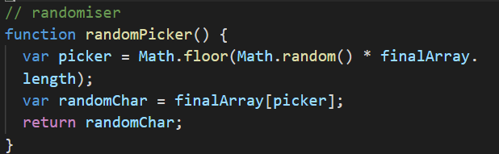
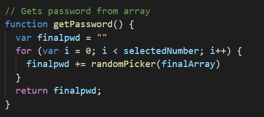

# 03 JavaScript: Password Generator

[Link to webpage](https://nvrtis.github.io/password-generator/)

## Introduction

This assignment included finished index.html, style.css and a starting javascript.

The assignment was the create a Password generator that the user can choose what criterias it wants in the password. The criterias was uppercase letters, lowercase letters, numbers and symbols. The final password has to atleast include one of the criterias, if it was choosen.

## Javascript Code

The Javascript window started with a addEventListener event which reacted to when a user clicks on the generate password button. The click will start the writePassword function. 

The function is already set, so that when the user gets var password = functionname () working, it will appear on the text area "Your Secure Password" area on the html page.

This is how my code looked after some modifications. I added a series of function that will activiate after the button press. 
The reasoning behind having several functions instead of one function was to be able to go through the code and having a easier time debugging and having the code more organized.

The function GetPwdLength was used to get the users input into a variable that could be used latter on in the code. 
I needed certain criterias to be sure that the user entered in a valid length which was between 8-128 characters and that the user entered in a number, which is done by if statments. functions end by taking the variable charCount from the local window and becoming SelectedNumber which is in the global window.

the getCharSelection function is used to both get the users criteria for password (uppercase, lowercase, number and/or symbols) and to save that information. The user is asked with confirm windows, which i will recieve either true or false statments. I also added a criteria with an if statment, that the user needed to pick atleast one criteria.

The object finalChars is used to store the information where i could access it in another function. it is done by using includeLowerC: includeLowerC, this will save the variable as includeLowerC = true/false, depending on what action the user pressed when the confirm window appeared for that criteria. 

The next function will be the getCharArray with the input of finalChars from the previous function to either confirm if the criterias will be pused into the allTheArrays variable. If the user pressed ok on the criteria includesymbols, then a for loop which will push all the special symbols that is in the specialChar array into the allTheArrays. The function will end with allTheArrays becoming the variable finalArray that is in the global window.

The randomPicker function choses at random a character that the user accepted, and is added into finalArray.

The final function is where we put the input we recieved earlier together. the User chose the length with selectedNumber and randomPicker randomises the code. The finalpwd is everything put together in a string form.

## Conclussion
I learned alot during this assignment, and even though i managed to make a password generator i am still missing one of the acceptance criteria, I could not find out a way to make sure my final password included atleast one character from each criteria. I did attempt to create som if statements and/or see if i could use the .inculded() property.

Also i could have managed to make this password generator with the use of concat() method, instead have my complicated array function. The reason i did not use it was because i learned of it a bit to late, and i had managed that part of the code working.