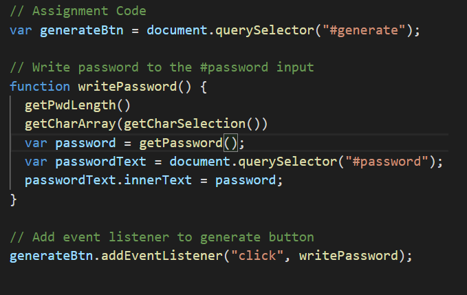

# 03 JavaScript: Password Generator


[Link to webpage](https://nvrtis.github.io/password-generator/)


## Introduction

This assignment included finished index.html, style.css and a starting javascript.

The assignment was the create a Password generator that the user can choose what criterias it wants in the password. The criterias was uppercase letters, lowercase letters, numbers and symbols. The final password has to atleast include one of the criterias, if it was choosen.


## Javascript Code

The Javascript window started with a addEventListener event which reacted to when a user clicks on the generate password button. The click will start the writePassword function. 

The function is already set, so that when the user gets var password = functionname () working, it will appear on the text area "Your Secure Password" area on the html page.



This is how my code looked after some modifications. I added a series of function that will activiate after the button press. 
The reasoning behind having several functions instead of one function was to be able to go through the code and having a easier time debugging and having the code more organized.


The function GetPwdLength was used to get the users input into a variable that could be used latter on in the code. 
I needed certain criterias to be sure that the user entered in a valid length which was between 8-128 characters and that the user entered in a number, which is done by if statments


the getCharSelection function is used to both get the users criteria for password (uppercase, lowercase, number and/or symbols) and to save that information. I asked the user with confirm windows, which i will recieve either true or false statments in. I also added a criteria with an if statment, that the user needed to pick atleast one criteria.

The variable finalChars is used to store the information where i could access it in another function. it is done by using includeLowerC: includeLowerC, this will save the variable as includeLowerC = true/false, depending on what action the user pressed when the confirm window appeared for that criteria. 


The next function will be the getCharArray with the input of finalChars from the previous function to either confirm if the criterias will be pused into the allTheArrays variable. If the user pressed ok on the criteria includesymbols, then a for loop which will push all the special symbols that is in the specialChar array into the allTheArrays.


## Your Task

This week’s homework requires you to modify starter code to create an application that enables employees to generate random passwords based on criteria that they’ve selected. This app will run in the browser and will feature dynamically updated HTML and CSS powered by JavaScript code that you write. It will have a clean and polished, responsive user interface that adapts to multiple screen sizes.

The password can include special characters. If you’re unfamiliar with these, see this [list of password special characters](https://www.owasp.org/index.php/Password_special_characters) from the OWASP Foundation.

## User Story

```
AS AN employee with access to sensitive data
I WANT to randomly generate a password that meets certain criteria
SO THAT I can create a strong password that provides greater security
```

## Acceptance Criteria

```
GIVEN I need a new, secure password
WHEN I click the button to generate a password
THEN I am presented with a series of prompts for password criteria
WHEN prompted for password criteria
THEN I select which criteria to include in the password
WHEN prompted for the length of the password
THEN I choose a length of at least 8 characters and no more than 128 characters
WHEN prompted for character types to include in the password
THEN I choose lowercase, uppercase, numeric, and/or special characters
WHEN I answer each prompt
THEN my input should be validated and at least one character type should be selected
WHEN all prompts are answered
THEN a password is generated that matches the selected criteria
WHEN the password is generated
THEN the password is either displayed in an alert or written to the page
```


## Grading Requirements

This homework is graded based on the following criteria: 

### Technical Acceptance Criteria: 40%

* Satisfies all of the preceding acceptance criteria plus the following:

  * The homework should not produce any errors in the console when you inspect it using Chrome DevTools.

### Deployment: 32%

* Application deployed at live URL.

* Application loads with no errors.

* Application GitHub URL submitted.

* GitHub repository that contains application code.

### Application Quality: 15%

* Application user experience is intuitive and easy to navigate.

* Application user interface style is clean and polished.

* Application resembles the mock-up functionality provided in the homework instructions.

### Repository Quality: 13%

* Repository has a unique name.

* Repository follows best practices for file structure and naming conventions.

* Repository follows best practices for class/id naming conventions, indentation, quality comments, etc.

* Repository contains multiple descriptive commit messages.

* Repository contains quality readme file with description, screenshot, and link to deployed application.

## Review

You are required to submit the following for review:

* The URL of the deployed application.

* The URL of the GitHub repository, with a unique name and a readme describing the project.

- - -

© 2020 Trilogy Education Services, LLC, a 2U, Inc. brand. Confidential and Proprietary. All Rights Reserved.
